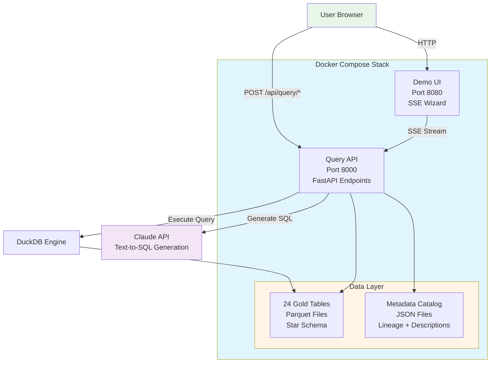

# JobForge + Orbit Architecture

## Overview

**JobForge** is a workforce intelligence platform that deploys a governed, self-imputing semantic model (WiQ) with full data lineage and provenance tracking. It ingests authoritative Canadian occupational data (NOC, COPS forecasts, OaSIS proficiencies) through a medallion pipeline, producing 24 queryable gold tables with a star schema.

**Orbit Integration** provides a natural language query interface to the WiQ data layer, enabling users to ask workforce intelligence questions without writing SQL. Questions like "How many software developers are projected for 2025?" are classified by intent, routed to appropriate endpoints, and answered with auditable provenance.

### Core Value

**Auditable provenance from source to output** — every artifact traces back to authoritative sources. When asked "where did this come from?", JobForge can answer with the complete pipeline path, including governance compliance mappings (DADM, DAMA DMBOK, Classification Policy).

## Architecture Diagram



**Data Flow:**
1. User submits question via browser (Demo UI) or direct API call
2. Intent classification determines query type (data/metadata/compliance)
3. Data queries: Claude generates SQL → DuckDB executes → Results with provenance
4. Metadata queries: Pattern matching routes to lineage engine → Provenance explanation
5. Compliance queries: Framework-specific RTM generator → Governance report

## Component Descriptions

### Query API

FastAPI application providing HTTP endpoints for natural language queries:

- **POST /api/query/data** - Convert natural language to SQL, execute against gold tables
- **POST /api/query/metadata** - Answer lineage and provenance questions
- **GET /api/compliance/{framework}** - Generate compliance reports (DADM, DAMA, Classification)
- **GET /api/tables** - List available gold tables
- **GET /api/health** - Health check for service orchestration

The API uses Claude (Anthropic) for text-to-SQL generation and DuckDB for query execution.

### Demo UI

SSE-powered deployment narration wizard that visualizes the data pipeline execution in real-time:

- Browser-based interface on port 8080
- Server-Sent Events (SSE) stream progress updates
- Demonstrates medallion pipeline (staged → bronze → silver → gold)
- Shows Power BI semantic model deployment

Provides a visual understanding of JobForge's governance-first approach.

### Gold Layer

24 star-schema Parquet tables organized by domain:

**Dimensions:**
- `dim_noc` - National Occupational Classification (516 unit groups)
- `dim_occupations` - TBS Occupational Groups (217 groups)
- `job_architecture` - Job titles and classification mappings (1,987 titles)

**NOC Elements (attributes):**
- `element_labels` - NOC unit group descriptors
- `element_lead_statement` - Primary occupation descriptions
- `element_main_duties` - Detailed duty lists
- `element_employment_requirements` - Education/licensing requirements
- `element_example_titles` - Sample job titles per NOC
- `element_exclusions` - What's not included in the NOC
- `element_additional_information` - Supplemental notes
- `element_workplaces_employers` - Common work environments

**OaSIS Proficiencies:**
- `oasis_abilities` - Required abilities (cognitive, physical, psychomotor)
- `oasis_skills` - Required skills (basic, cross-functional, technical)
- `oasis_knowledges` - Required knowledge domains
- `oasis_workactivities` - Common work activities
- `oasis_workcontext` - Work environment context

**COPS Forecasts (10-year projections):**
- `cops_employment` - Total employment by NOC and year
- `cops_employment_growth` - Employment growth rates
- `cops_immigration` - Immigration numbers by NOC
- `cops_retirement_rates` - Retirement rate percentages
- `cops_retirements` - Total retirements by NOC and year
- `cops_school_leavers` - School leavers entering workforce
- `cops_other_replacement` - Other replacement sources
- `cops_other_seekers` - Other job seekers

**Relationships:** 22 star-schema relationships connecting dimensions to facts.

### Metadata Catalog

JSON files providing semantic metadata for each table and column:

- **Table lineage** - Upstream sources and transformation steps
- **Column descriptions** - Human-readable explanations of each field
- **Workforce dynamics** - Demand vs supply classification
- **Year templates** - Context for temporal columns (2023-2033)
- **Source attribution** - Provenance mapping to authoritative sources

The catalog enables the Query API to provide context-aware SQL generation and lineage explanations.

### Intent System

Pattern-based query classification routes questions to appropriate endpoints:

**Configuration Files:**
- `orbit/config/adapters/jobforge.yaml` - Endpoint routing, HTTP configuration
- `orbit/config/intents/wiq_intents.yaml` - Domain vocabulary, entity patterns

**Intent Categories:**
- **data_query** - Questions requiring SQL execution (counts, aggregations, lookups)
- **metadata_query** - Questions about lineage, structure, provenance
- **compliance_query** - Questions about governance framework adherence

**Fallback Behavior:** When pattern matching is inconclusive, the system uses Claude (Sonnet 4.5) for LLM-based intent classification.

## Data Flow

### Query Path (Natural Language to Results)

1. **User submits question**
   - Via Demo UI (browser at localhost:8080) or
   - Direct API call (POST to localhost:8000/api/query/data)

2. **Intent classification**
   - Pattern matching checks jobforge.yaml intent patterns
   - If match confidence > threshold: route to endpoint
   - If ambiguous: fallback to LLM classification using wiq_intents.yaml

3. **Route to endpoint**
   - **data_query** → POST /api/query/data
   - **metadata_query** → POST /api/query/metadata
   - **compliance_query** → GET /api/compliance/{framework}

4. **For data queries:**
   - Generate enhanced DDL with semantic metadata (table descriptions, column comments, relationships)
   - Add workforce intelligence hints (demand/supply tables, entity recognition patterns)
   - Send to Claude API with question + DDL context
   - Claude returns SQL query with explanation
   - DuckDB executes SQL against gold Parquet files
   - Results include source attribution (which tables/sources used)

5. **Return results with provenance**
   - SQL query (for transparency)
   - Natural language explanation (Claude's reasoning)
   - Tabular results (from DuckDB)
   - Source attribution (metadata catalog mapping)

### Provenance Flow (Lineage Queries)

1. User asks "Where does dim_noc come from?"
2. Metadata query endpoint parses question
3. Lineage engine (NetworkX graph) traverses catalog
4. Returns transformation path: `Statistics Canada NOC → staged → bronze → silver → gold`
5. Includes DADM compliance references (which directive sections apply)

## Deployment Model

### Single-Command Startup

```bash
./start.sh               # Unix/Mac
start.bat                # Windows
```

**What happens:**
1. Docker Compose builds API and Demo containers
2. API service starts, exposes port 8000
3. Healthcheck polls `/api/health` until ready
4. Demo service starts (depends on API health), exposes port 8080
5. Browser auto-opens to http://localhost:8080

### Service Orchestration

- **API healthcheck:** `curl -f http://localhost:8000/api/health` (10s interval)
- **Demo dependency:** `depends_on: api.condition: service_healthy`
- **Volume mount:** `./data:/app/data` enables updates without rebuild
- **Environment config:** `.env` file sets API keys and ports

### Multi-Architecture Support

- Base image: `python:3.11-slim` (AMD64 + ARM64)
- Cross-platform browser launch (macOS, Windows, Linux)
- Editable install enables development workflow in containers

## Security & Governance

### API Key Management

- **ANTHROPIC_API_KEY** required for data queries (text-to-SQL)
- Configured via `.env` file (not committed to git)
- API returns actionable error guidance if key missing

### CORS Configuration

- Environment-based: `CORS_ORIGINS` in `.env`
- Defaults: `http://localhost:3000,http://localhost:8080`
- No code changes needed for different deployments

### Error Handling

- **RFC 9457 Problem Details** format for errors
- Sanitized messages (no stack traces to users)
- Actionable guidance (what to do next)
- Structured logging via `structlog` for debugging

### Compliance Traceability

- **DADM** - Directive on Automated Decision Making compliance
- **DAMA DMBOK** - 11 knowledge area alignment
- **Classification Policy** - Job classification adherence
- Requirements Traceability Matrix (RTM) generation via `/api/compliance/{framework}`

## Technology Stack

- **Python 3.11** - Core language
- **FastAPI** - Query API framework
- **DuckDB** - Analytical query engine (in-process)
- **Polars** - Data pipeline processing
- **Pydantic 2** - Data validation and serialization
- **NetworkX** - Lineage graph management
- **Anthropic Claude** - Text-to-SQL generation
- **Docker Compose** - Service orchestration
- **SSE (Server-Sent Events)** - Real-time demo streaming

## Scalability Considerations

**Current Architecture:**
- Single-container API (suitable for demo and development)
- In-process DuckDB (no separate database server)
- Parquet files on local filesystem (24 tables ~1.3 MB total)

**Production Scaling:**
- Add load balancer for multiple API instances
- Consider DuckDB remote storage (S3-compatible)
- Implement caching layer (Redis) for frequently asked questions
- Rate limiting for external API calls (Claude)
- Monitoring and observability (Prometheus, Grafana)

**Data Volume:**
- Current: 24 tables, 516 occupations, 10 years projections (~1.3 MB)
- Growth: Additional COPS updates (annual), new OaSIS releases, extended forecasts
- Parquet compression handles growth efficiently
